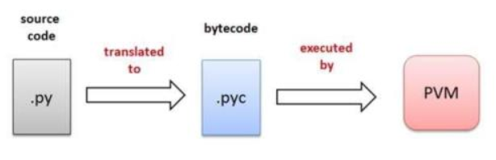

- [PYTHON三问](#python三问)
  - [是什么(what)](#是什么what)
  - [为什么选择python(why)](#为什么选择pythonwhy)
  - [运用场景(where)](#运用场景where)
- [基础语法](#基础语法)

# PYTHON三问

## 是什么(what)

&emsp;&emsp;Python是一门解释型计算机程序设计语言。
之所以称之为解释型语言，是因为它没有显示的调用编译操作，表现出解释型的特性比较多而已。其实它跟编译型语言JAVA一样，都需要先编译成字节码，然后交给虚拟机执行。  
&emsp;&emsp;Python 的战略是要做一种简单、易用但专业、严谨的通用组合语言，或者叫胶水语言，让普通人也能够很容易的入门，把各种基本程序元件拼装在一起，协调运作。
Python 始终把开发者效率放在CPU效率前面，始终把横向扩张的能力放在纵向深潜能力之前。长期坚持这些战略选择，为 Python 带来了其他语言望尘莫及的丰富生态。
任何一个人，只要愿意学习，可以在几天的时间里学会Python基础部分，然后干很多很多事情，这种投入产出比可能是其他任何语言都无法相比的。

## 为什么选择python(why)

1. 易于学习、阅读和维护：关键字相对较少，结构简单，语法定义明确。虽然与 java/C/C++ 的运行速度的比较，Python 慢的多，但在开发被频繁使用的核心程序库时，
大量使用 C 语言跟它配合，结果用 Python 开发的真实程序跑起来非常快，因为很有可能超过 80% 的时间系统执行的代码是 C 写的。
2. 可移植性强：Python支持多种解释器，可跨平台。
>Python解释器机制(CPython)  
1.执行 python XX.py 后，将会启动 Python 的解释器  
2.python解释器的编译器会将.py源文件编译（解释）成字节码生成PyCodeObject字节码对象存放在内存中。  
3.python解释器的虚拟机将执行内存中的字节码对象转化为机器语言，虚拟机与操作系统交互，使机器语言在机器硬件上运行。  
4.运行结束后python解释器则将PyCodeObject写回到pyc文件中。当python程序第二次运行时，首先程序会在硬盘中寻找pyc文件，如果找到，则直接载入，否则就重复上面的过程。  
 
3. 生态系统完善：有强大的标准库，同时支持第三方库和包的扩展应用，甚至可以自定义任何库和包。Pypi(https://pypi.org/)是其第三方库的仓库。
4. 高速增长，应用场景广  

跟java的优劣对比  

|      | PYTHON    | JAVA    |
|------|-----------|---------|
| 编程思想 | 面向过程，面向对象 | 高度面向对象  |
| 可读性  | 强         | 弱       |
| 运行效率 | 低         | 高       |
| 安全性  | 差，直接提供源码  | 强,jar加密 |

## 运用场景(where)

1. 网络爬虫，在爬虫领域，Python几乎是霸主地位。虽然其他语言也可以做网络爬虫，但由于python语言的特性，数据爬取比其它语言代码更简洁，效率更高。你可以使用python将网络一切数据作为资源，通过自动化程序进行有针对性的数据抓取。
2. 数据分析和数据可视化，当爬虫爬取到足够多的数据后，下一步就是数据分析。在大量数据的基础上，结合科学计算、机器学习等技术，对数据进行清洗、去重、规格化和针对性的分析是大数据行业的基石，而Python正是数据分析的主流语言之一。同时，利用python中的matplotlib和seaborn这两个绘图和统计库（还有很多其他的绘图库），可以让我们很轻松实现数据的可视化。
3. Web开发，Python是一种解释型的脚本语言，开发效率比较高，所以非常适合用来做Web开发，比如豆瓣网，知乎，YouTube，Google等知名网站都使用了python。
4. 深度学习，人工智能，无论是在传统机器学习还是深度学习领域Python都占有不可替代的地位。许多诸如Scikit-learn、Tensorflow等机器学习和深度学习库使得Python极具优势。而机器学习，深度学习正是人工智能的基石。
5. 另外，Python也经常运用在云计算，自动运维，游戏开发等领域。

# 基础语法